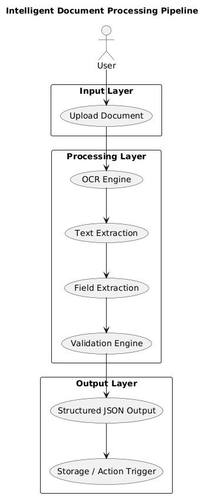

# 📄 Intelligent Document Processing Pipeline

## Overview
This project is an AI-powered document processing system that extracts structured data from images (invoices/forms) and validates the extracted information before triggering downstream actions.

The system is designed as a modular pipeline to simulate real-world document automation workflows.

---

## Features

- Upload document (JPG/PNG)
- OCR-based text extraction
- Field extraction (Name, Amount, Date, ID)
- Data validation with error handling
- Structured JSON output
- Action trigger (store processed data)

---

## Architecture Diagram



---

## Tech Stack

- Python
- Flask
- Tesseract OCR
- Regex (for field extraction)

---

## Project Structure

project/
│── app.py              # Main Flask app
│── ocr.py              # OCR processing
│── extractor.py        # Field extraction logic
│── validator.py        # Validation logic
│── uploads/            # Uploaded documents
│── outputs.json        # Processed outputs
│── README.md

---

##  How to Run

### 1. Clone the repository
### 2. Activate virtual environment
### 3. Install dependencies
### 4. Install Tesseract OCR (Mac)
### 5. Run the application
### 6. Open in browser
http://127.0.0.1:5000

---

## Sample Input

Invoice image containing:
- Name
- Amount
- Date
- ID

---

## Sample Output

```json
{
  "data": {
    "name": "John Doe",
    "amount": "5000",
    "date": "20/03/2026",
    "id": "INV123"
  },
  "validation": {
    "status": "VALID",
    "errors": []
  }
}